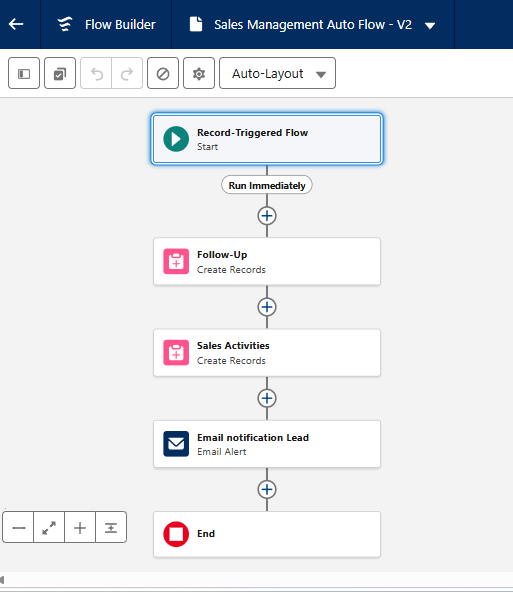
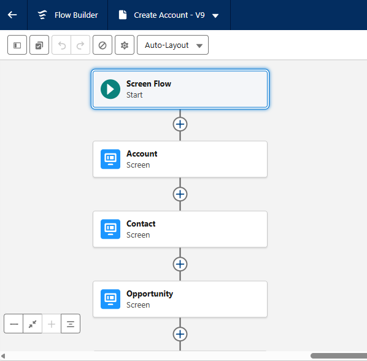
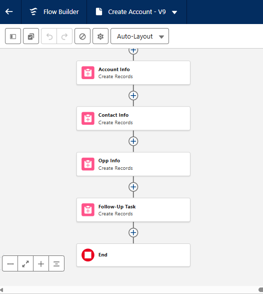
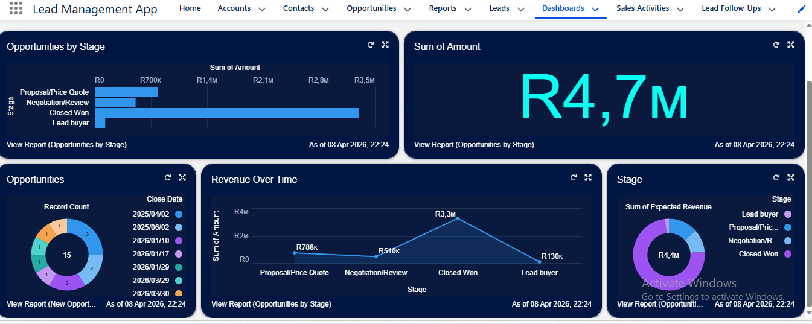

# Lead-Management-App
## Objectives
To efficiently capture, track, and convert leads into opportunities through automation, data insights, and streamlined sales processes.

## Customer Objects
Both Sale Activity/Task and Lead Field are linked to **Lead** object as their master relationship
### ✅Sale Activity/Task
   - **Outcomes** = Follow up Needed, Successful, No Response
   - **Activity Type** = Call, Email, Web
   - **Activity Date** = Date

### ✅Lead Field 
   - **Status** = Pending, Completed, Cancelled
   - **Follow-Up Date** = Date
   - **Note** = Long Text

## ⚒️Tools Used
   - Record Trigering Flow
   - Screen Record Flow
   - Validation Rule
   - Approval Process
   - Formulas
   - Page Layout
   - Dashboard

## 📷Screen Shots

### Auto Triggering Flow
   
### Screen Flow
 |  |  |
### Dashboard
   

    
